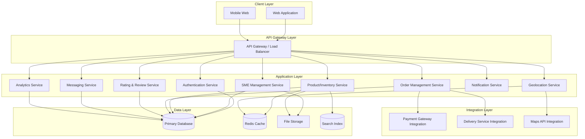
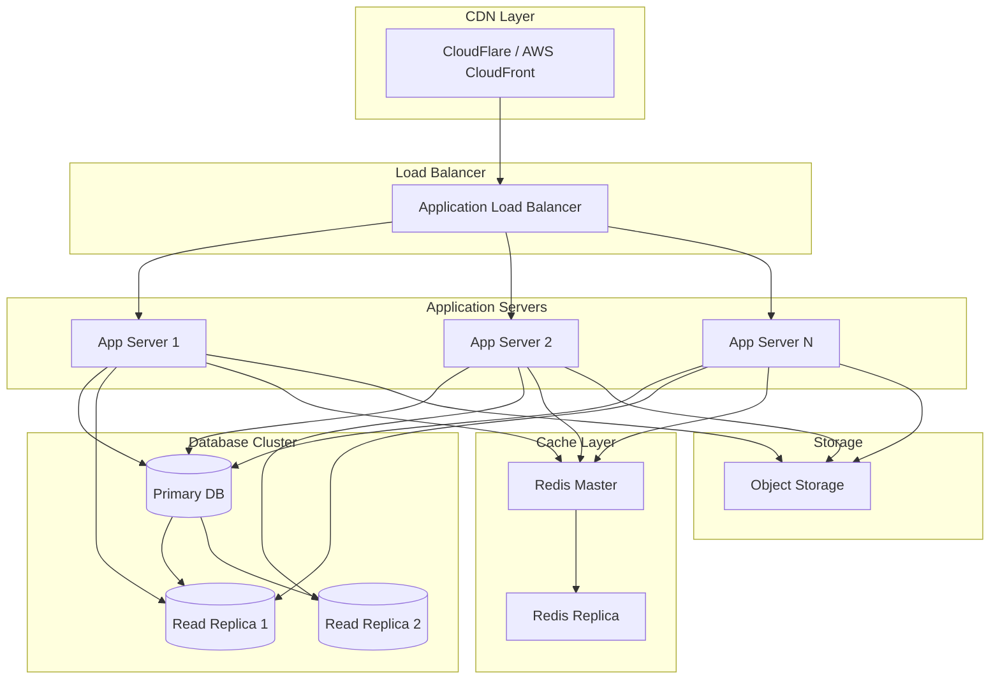

# CoShop Marketplace Platform - Design Document

## Overview

CoShop is a comprehensive marketplace platform that empowers Small and Medium-sized Enterprises (SMEs) to establish and scale their online presence. The platform provides a unified ecosystem where SMEs can manage their business profiles, inventory, and orders while consumers discover local businesses through geolocation-based search, browse products, and complete purchases with integrated delivery options.

The platform architecture follows a modern web application design with a clear separation between frontend presentation, backend business logic, and data persistence layers. Key integrations include third-party payment gateways, delivery services (Uber, Pick Up Mtaani), and mapping services for geolocation features.

## Architecture

### High-Level Architecture



### Technology Stack Recommendations

**Frontend:**
- React.js or Vue.js for web application
- Responsive CSS framework (Tailwind CSS or Material-UI)
- Leaflet or Google Maps JavaScript API for mapping
- WebSocket for real-time messaging and notifications

**Backend:**
- Node.js with Express.js or Python with FastAPI
- RESTful API design with JWT authentication
- WebSocket server for real-time features

**Database:**
- PostgreSQL with PostGIS extension for geospatial data
- Redis for caching and session management
- Elasticsearch for product search functionality

**Storage:**
- AWS S3 or similar object storage for images and documents

**Integrations:**
- Stripe/PayPal/M-Pesa for payment processing
- Uber API, Pick Up Mtaani API for delivery
- Google Maps API or OpenStreetMap for mapping

**Development Guidelines:**
- Always investigate existing codebase before making changes to understand current implementation patterns
- Use Context7 to verify package API usage and documentation before implementation
- Consult Context7 for up-to-date library documentation and best practices
- Reference Context7 when integrating third-party services and APIs
- Review related code files to maintain consistency with existing architecture

## Components and Interfaces

### 1. Authentication Service

**Responsibilities:**
- User registration and login (SMEs and consumers)
- JWT token generation and validation
- Password reset and email verification
- Role-based access control (RBAC)

**Key Interfaces:**
```typescript
interface AuthService {
  register(userData: UserRegistration): Promise<User>;
  login(credentials: LoginCredentials): Promise<AuthToken>;
  verifyToken(token: string): Promise<User>;
  resetPassword(email: string): Promise<void>;
  refreshToken(refreshToken: string): Promise<AuthToken>;
}

interface UserRegistration {
  email: string;
  password: string;
  userType: 'sme' | 'consumer';
  businessInfo?: BusinessRegistration;
}

interface AuthToken {
  accessToken: string;
  refreshToken: string;
  expiresIn: number;
}
```

### 2. SME Management Service

**Responsibilities:**
- Business registration and profile management
- Business verification workflow
- Staff account management
- Business location and operating hours

**Key Interfaces:**
```typescript
interface SMEService {
  registerBusiness(businessData: BusinessRegistration): Promise<Business>;
  updateProfile(businessId: string, updates: BusinessUpdate): Promise<Business>;
  submitVerification(businessId: string, documents: Document[]): Promise<VerificationRequest>;
  addStaffMember(businessId: string, staffData: StaffMember): Promise<StaffMember>;
  updateLocation(businessId: string, location: GeoLocation): Promise<void>;
}

interface Business {
  id: string;
  name: string;
  description: string;
  businessType: 'shop' | 'business' | 'service';
  location: GeoLocation;
  contactInfo: ContactInfo;
  operatingHours: OperatingHours[];
  verified: boolean;
  rating: number;
  createdAt: Date;
}

interface GeoLocation {
  latitude: number;
  longitude: number;
  address: string;
  city: string;
  country: string;
}
```

### 3. Product/Inventory Service

**Responsibilities:**
- Product catalog management
- Inventory tracking and updates
- Product search and filtering
- Category management

**Key Interfaces:**
```typescript
interface ProductService {
  createProduct(businessId: string, productData: ProductCreate): Promise<Product>;
  updateProduct(productId: string, updates: ProductUpdate): Promise<Product>;
  updateInventory(productId: string, quantity: number): Promise<void>;
  searchProducts(query: SearchQuery): Promise<Product[]>;
  getProductsByBusiness(businessId: string): Promise<Product[]>;
}

interface Product {
  id: string;
  businessId: string;
  name: string;
  description: string;
  price: number;
  quantity: number;
  category: string;
  images: string[];
  inStock: boolean;
  createdAt: Date;
  updatedAt: Date;
}

interface SearchQuery {
  keyword?: string;
  category?: string;
  minPrice?: number;
  maxPrice?: number;
  location?: GeoLocation;
  radius?: number;
  sortBy?: 'price' | 'distance' | 'rating';
}
```

### 4. Order Management Service

**Responsibilities:**
- Order creation and processing
- Order status tracking
- Payment integration
- Delivery service integration

**Key Interfaces:**
```typescript
interface OrderService {
  createOrder(consumerId: string, orderData: OrderCreate): Promise<Order>;
  updateOrderStatus(orderId: string, status: OrderStatus): Promise<Order>;
  getOrdersByConsumer(consumerId: string): Promise<Order[]>;
  getOrdersBySME(businessId: string): Promise<Order[]>;
  processPayment(orderId: string, paymentMethod: PaymentMethod): Promise<Payment>;
  arrangeDelivery(orderId: string, deliveryService: string): Promise<DeliveryInfo>;
}

interface Order {
  id: string;
  consumerId: string;
  businessId: string;
  items: OrderItem[];
  totalAmount: number;
  status: OrderStatus;
  deliveryMethod: 'pickup' | 'delivery';
  deliveryInfo?: DeliveryInfo;
  paymentStatus: 'pending' | 'completed' | 'failed';
  createdAt: Date;
}

type OrderStatus = 'pending' | 'confirmed' | 'ready' | 'out_for_delivery' | 'delivered' | 'cancelled';

interface DeliveryInfo {
  service: string;
  trackingId: string;
  estimatedDelivery: Date;
  cost: number;
}
```

### 5. Geolocation Service

**Responsibilities:**
- Map-based business discovery
- Distance calculations
- Location-based filtering
- Geocoding and reverse geocoding

**Key Interfaces:**
```typescript
interface GeolocationService {
  findNearbyBusinesses(location: GeoLocation, radius: number): Promise<Business[]>;
  calculateDistance(from: GeoLocation, to: GeoLocation): Promise<number>;
  geocodeAddress(address: string): Promise<GeoLocation>;
  getBusinessesInBounds(bounds: MapBounds): Promise<Business[]>;
}

interface MapBounds {
  northEast: GeoLocation;
  southWest: GeoLocation;
}
```

### 6. Rating & Review Service

**Responsibilities:**
- Consumer ratings for SMEs and products
- SME ratings for consumers (trust score)
- Review management
- Rating aggregation

**Key Interfaces:**
```typescript
interface RatingService {
  rateBusinessByConsumer(orderId: string, rating: ConsumerRating): Promise<Rating>;
  rateConsumerBySME(orderId: string, rating: SMERating): Promise<Rating>;
  getBusinessRatings(businessId: string): Promise<Rating[]>;
  getConsumerTrustScore(consumerId: string): Promise<TrustScore>;
  respondToReview(ratingId: string, response: string): Promise<void>;
}

interface ConsumerRating {
  businessId: string;
  productId?: string;
  stars: number;
  review: string;
  criteria: {
    productQuality: number;
    service: number;
    value: number;
  };
}

interface SMERating {
  consumerId: string;
  stars: number;
  feedback: string;
  criteria: {
    paymentTimeliness: number;
    communication: number;
    compliance: number;
  };
}

interface TrustScore {
  consumerId: string;
  overallScore: number;
  totalRatings: number;
  breakdown: {
    paymentTimeliness: number;
    communication: number;
    compliance: number;
  };
}
```

### 7. Messaging Service

**Responsibilities:**
- Real-time messaging between consumers and SMEs
- Message history
- Automated responses
- Notification triggers

**Key Interfaces:**
```typescript
interface MessagingService {
  sendMessage(from: string, to: string, message: Message): Promise<Message>;
  getConversation(userId1: string, userId2: string): Promise<Message[]>;
  setAutoResponse(businessId: string, autoResponse: AutoResponse): Promise<void>;
  markAsRead(messageId: string): Promise<void>;
}

interface Message {
  id: string;
  senderId: string;
  receiverId: string;
  content: string;
  timestamp: Date;
  read: boolean;
}
```

### 8. Notification Service

**Responsibilities:**
- Multi-channel notifications (email, SMS, push, in-app)
- Notification preferences management
- Notification batching and prioritization
- Notification history

**Key Interfaces:**
```typescript
interface NotificationService {
  sendNotification(userId: string, notification: Notification): Promise<void>;
  updatePreferences(userId: string, preferences: NotificationPreferences): Promise<void>;
  getNotificationHistory(userId: string): Promise<Notification[]>;
  markAsRead(notificationId: string): Promise<void>;
}

interface Notification {
  id: string;
  userId: string;
  type: NotificationType;
  title: string;
  message: string;
  priority: 'low' | 'medium' | 'high';
  channels: ('email' | 'sms' | 'push' | 'in_app')[];
  timestamp: Date;
}

type NotificationType = 'new_order' | 'message' | 'review' | 'low_inventory' | 'payment' | 'delivery_update';
```

### 9. Analytics Service

**Responsibilities:**
- Business performance metrics
- Sales analytics
- Customer insights
- Report generation

**Key Interfaces:**
```typescript
interface AnalyticsService {
  getBusinessMetrics(businessId: string, period: TimePeriod): Promise<BusinessMetrics>;
  getProductPerformance(businessId: string): Promise<ProductMetrics[]>;
  getCustomerDemographics(businessId: string): Promise<Demographics>;
  exportData(businessId: string, format: 'csv' | 'json'): Promise<string>;
}

interface BusinessMetrics {
  totalOrders: number;
  totalRevenue: number;
  averageOrderValue: number;
  productViews: number;
  conversionRate: number;
  averageRating: number;
  trends: {
    date: Date;
    orders: number;
    revenue: number;
  }[];
}
```

## Data Models

### Database Schema

**Users Table:**
```sql
CREATE TABLE users (
  id UUID PRIMARY KEY,
  email VARCHAR(255) UNIQUE NOT NULL,
  password_hash VARCHAR(255) NOT NULL,
  user_type VARCHAR(20) NOT NULL CHECK (user_type IN ('sme', 'consumer')),
  created_at TIMESTAMP DEFAULT CURRENT_TIMESTAMP,
  updated_at TIMESTAMP DEFAULT CURRENT_TIMESTAMP
);
```

**Businesses Table:**
```sql
CREATE TABLE businesses (
  id UUID PRIMARY KEY,
  owner_id UUID REFERENCES users(id),
  name VARCHAR(255) NOT NULL,
  description TEXT,
  business_type VARCHAR(20) CHECK (business_type IN ('shop', 'business', 'service')),
  location GEOGRAPHY(POINT, 4326),
  address TEXT,
  city VARCHAR(100),
  country VARCHAR(100),
  contact_email VARCHAR(255),
  contact_phone VARCHAR(50),
  verified BOOLEAN DEFAULT FALSE,
  rating DECIMAL(3,2) DEFAULT 0,
  total_ratings INTEGER DEFAULT 0,
  created_at TIMESTAMP DEFAULT CURRENT_TIMESTAMP,
  updated_at TIMESTAMP DEFAULT CURRENT_TIMESTAMP
);

CREATE INDEX idx_businesses_location ON businesses USING GIST(location);
CREATE INDEX idx_businesses_verified ON businesses(verified);
```

**Products Table:**
```sql
CREATE TABLE products (
  id UUID PRIMARY KEY,
  business_id UUID REFERENCES businesses(id) ON DELETE CASCADE,
  name VARCHAR(255) NOT NULL,
  description TEXT,
  price DECIMAL(10,2) NOT NULL,
  quantity INTEGER NOT NULL DEFAULT 0,
  category VARCHAR(100),
  images TEXT[],
  in_stock BOOLEAN GENERATED ALWAYS AS (quantity > 0) STORED,
  created_at TIMESTAMP DEFAULT CURRENT_TIMESTAMP,
  updated_at TIMESTAMP DEFAULT CURRENT_TIMESTAMP
);

CREATE INDEX idx_products_business ON products(business_id);
CREATE INDEX idx_products_category ON products(category);
CREATE INDEX idx_products_in_stock ON products(in_stock);
```

**Orders Table:**
```sql
CREATE TABLE orders (
  id UUID PRIMARY KEY,
  consumer_id UUID REFERENCES users(id),
  business_id UUID REFERENCES businesses(id),
  total_amount DECIMAL(10,2) NOT NULL,
  status VARCHAR(50) NOT NULL,
  delivery_method VARCHAR(20) CHECK (delivery_method IN ('pickup', 'delivery')),
  payment_status VARCHAR(20) CHECK (payment_status IN ('pending', 'completed', 'failed')),
  created_at TIMESTAMP DEFAULT CURRENT_TIMESTAMP,
  updated_at TIMESTAMP DEFAULT CURRENT_TIMESTAMP
);

CREATE INDEX idx_orders_consumer ON orders(consumer_id);
CREATE INDEX idx_orders_business ON orders(business_id);
CREATE INDEX idx_orders_status ON orders(status);
```

**Order Items Table:**
```sql
CREATE TABLE order_items (
  id UUID PRIMARY KEY,
  order_id UUID REFERENCES orders(id) ON DELETE CASCADE,
  product_id UUID REFERENCES products(id),
  quantity INTEGER NOT NULL,
  price_at_purchase DECIMAL(10,2) NOT NULL,
  created_at TIMESTAMP DEFAULT CURRENT_TIMESTAMP
);
```

**Ratings Table:**
```sql
CREATE TABLE ratings (
  id UUID PRIMARY KEY,
  order_id UUID REFERENCES orders(id),
  rater_id UUID REFERENCES users(id),
  rated_id UUID REFERENCES users(id),
  rating_type VARCHAR(20) CHECK (rating_type IN ('consumer_to_sme', 'sme_to_consumer')),
  stars INTEGER CHECK (stars >= 1 AND stars <= 5),
  review TEXT,
  criteria JSONB,
  created_at TIMESTAMP DEFAULT CURRENT_TIMESTAMP
);

CREATE INDEX idx_ratings_rated ON ratings(rated_id, rating_type);
```

**Messages Table:**
```sql
CREATE TABLE messages (
  id UUID PRIMARY KEY,
  sender_id UUID REFERENCES users(id),
  receiver_id UUID REFERENCES users(id),
  content TEXT NOT NULL,
  read BOOLEAN DEFAULT FALSE,
  created_at TIMESTAMP DEFAULT CURRENT_TIMESTAMP
);

CREATE INDEX idx_messages_conversation ON messages(sender_id, receiver_id);
```

**Notifications Table:**
```sql
CREATE TABLE notifications (
  id UUID PRIMARY KEY,
  user_id UUID REFERENCES users(id),
  type VARCHAR(50) NOT NULL,
  title VARCHAR(255) NOT NULL,
  message TEXT NOT NULL,
  priority VARCHAR(20),
  read BOOLEAN DEFAULT FALSE,
  created_at TIMESTAMP DEFAULT CURRENT_TIMESTAMP
);

CREATE INDEX idx_notifications_user ON notifications(user_id, read);
```

## Error Handling

### Error Response Format

All API errors will follow a consistent format:

```typescript
interface ErrorResponse {
  error: {
    code: string;
    message: string;
    details?: any;
    timestamp: string;
  };
}
```

### Error Categories

1. **Authentication Errors (401)**
   - Invalid credentials
   - Expired token
   - Insufficient permissions

2. **Validation Errors (400)**
   - Missing required fields
   - Invalid data format
   - Business rule violations

3. **Not Found Errors (404)**
   - Resource does not exist
   - Business or product not found

4. **Conflict Errors (409)**
   - Duplicate registration
   - Inventory conflicts

5. **Integration Errors (502/503)**
   - Payment gateway failures
   - Delivery service unavailable
   - Maps API errors

6. **Server Errors (500)**
   - Database connection failures
   - Unexpected exceptions

### Error Handling Strategy

- All service methods should throw typed exceptions
- API gateway catches exceptions and transforms them to HTTP responses
- Critical errors trigger alerts to administrators
- User-facing errors provide actionable messages
- Integration failures implement retry logic with exponential backoff
- Failed transactions are logged for manual review

## Testing Strategy

### Unit Testing

**Coverage Requirements:**
- Minimum 80% code coverage for business logic
- 100% coverage for critical payment and order processing functions

**Test Focus:**
- Service layer business logic
- Data validation functions
- Utility functions
- Rating calculations
- Distance calculations

**Tools:**
- Jest (JavaScript/TypeScript)
- pytest (Python)
- Mock external dependencies (payment gateways, delivery APIs)

### Integration Testing

**Test Scenarios:**
- End-to-end order flow (browse → cart → checkout → payment → delivery)
- Business registration and verification workflow
- Product search with geolocation filtering
- Real-time messaging between users
- Payment gateway integration
- Delivery service integration

**Tools:**
- Supertest for API testing
- Test database with seed data
- Mock external API responses

### Performance Testing

**Metrics:**
- API response time < 200ms for 95th percentile
- Map loading with 1000+ businesses < 2 seconds
- Search results < 500ms
- Concurrent user capacity: 10,000+ simultaneous users

**Tools:**
- Apache JMeter or k6 for load testing
- Database query profiling
- CDN performance monitoring

### Security Testing

**Focus Areas:**
- SQL injection prevention
- XSS protection
- CSRF token validation
- JWT token security
- Payment data encryption
- File upload validation

**Tools:**
- OWASP ZAP for vulnerability scanning
- Manual penetration testing
- Code security analysis (SonarQube)

### User Acceptance Testing

**Test Cases:**
- SME onboarding flow
- Consumer shopping experience
- Mobile responsiveness
- Cross-browser compatibility
- Accessibility compliance (WCAG 2.1 Level AA)

## Deployment Architecture

### Infrastructure



### Scalability Considerations

- Horizontal scaling of application servers
- Database read replicas for query distribution
- Redis caching for frequently accessed data
- CDN for static assets and images
- Asynchronous job processing for notifications and analytics
- Message queue for order processing (RabbitMQ or AWS SQS)

### Monitoring and Observability

- Application performance monitoring (APM)
- Error tracking and logging (Sentry, ELK stack)
- Infrastructure monitoring (Prometheus, Grafana)
- Uptime monitoring
- Real-time alerts for critical failures
